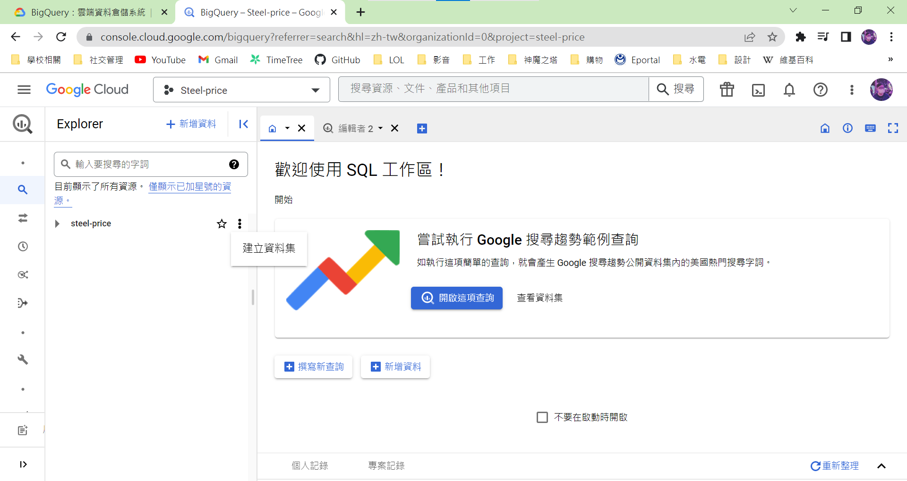

**將爬蟲程式在雲端自動化並且儲存自雲端資料庫**

　將想要固定頻率爬取網頁資訊，可以透過GCP(Google Cloud Platform)達成目的，主要分為三個部分，第一是透過Google BigQuery雲端數據庫建立雲端資料表，電腦離線時也不必擔心資料會消失，其次是將爬蟲程式部屬到GCP上，部屬到GCP不代表可以定時執行爬蟲程式，而是需要透過最後Google Scheduler(雲端排程器)達成此目的，如此即使電腦關機或是使用者不在使用介面上，也可以自動化並定時的處理爬蟲程式。

　以上步驟簡化如下：

1. 建立Google BigQuery資料表與其憑證
2. 將程式部屬到GCP與建立Google Cloud Function
3. 建立Google Scheduler

  

**建立Google BigQuery資料表**

- 到Google BigQuery頁面，點選建立資料集。

    -   
    
    -   
    

- 建立完資料集後，接著建立資料表。

    -   
    

- 建立所需的資料表名稱、項目類型、數量、資料型態等

    -   
    

- 建立完資料表後觀看資料表詳細資訊，其中資料表ID在後續中會使用到。(steel-price.LME\_Price.main)

    - 

**建立Google BigQuery憑證**

- 點選『憑證』以進入畫面

    - 

- 點選『建立憑證』同時點選『服務帳戶』

    -   
    

- 設定好服務帳戶名稱，點選『建立並繼續』

    -   
    

- 將角色設定為『BigQuery管理員』

    -   
    

- 之後點選繼續並保留預設值直到完成
- 點選『管理服務帳戶』以建立金鑰

    - 

- 點選進入金鑰畫面，並『建立新的金鑰』

    -   
    

- 選擇『JSON』並『建立』，之後便會取得檔案

    - 

- 要將爬取資料儲存進BigQuery資料表，需要透過Pandas、Pyarrow與Google BigQuery套件，而Pyarrow為Google BigQuery載入Pandas DataFrame資料的相依性套件，特別注意需要Python 64位元才可成功安裝。
- 設定Google的憑證路徑，並且利用os模組來設定「GOOGLE\_APPLICATION\_CREDENTIALS」環境變數

    ```python
    credentials_path = 'steel-price-d1b32df1752d.json'
    os.environ['GOOGLE_APPLICATION_CREDENTIALS'] = credentials_path
    ```
    

- 之後可以建立Google BigQuery用戶端物件，透過「load\_table\_from\_dataframe」方法，設定資料表ID，載入DataFrame中的爬取資料

    ```python
    client = bigquery.Client()
    table_id = 'stocks-bigquery.stocks.daily-price'
     
    job = client.load_table_from_dataframe(df, table_id)
    job.result()  #等待寫入完成
    
    ```
    

- 如果想要在執行後，瞭解寫入多少筆資料到Google BigQuery資料表(daily-price)，則可以利用get\_table()，傳入資料表ID，取得相關的訊息。

    ```python
    table = client.get_table(table_id)
    print(f'已存入{table.num_rows}筆資料到{table_id}')
    
    ```
    

- 順利完成後可以到Google BigQuery預覽資料表

    -   
    

**網頁爬蟲到Google(GCP)雲端平台**

- 產生該程式需要用到的套件，原先作者是使用『pip freeze > requirements.txt』指令，但後續此指令會將全部套件還有子套件全部記錄到檔案中，這會影響到後續雲端平台安裝套件，有人提出使用額外套件『pipreqs』可以只將目前程式需要的套件寫道文件中

    ```shell
    pip install pipreqs #安裝套件
    ```
    
    ```shell
    pipreqs #使用指令
    ```
    
      
    

**建立Google Cloud Function(雲端函式)**

- 進入到Cloud Function 畫面並建立函式

    -   
    

- 觸發條件選擇『Cloud Pub/Sub』，同時間『建立主題』

    -   
    

- 將『執行階段』設定為程式運行版本

    -   
    

- 將程式貼到main.py中並使用指定載入點，其餘檔案也透過複製方式加進專案中後，就可以部屬函式。

    - 

- 順利部屬後會出現綠色勾勾

    - 

- 部屬成功後進入『測試』畫面並『測試函式』是否可以成功運行，運行成功會在記錄檔中顯示相關資訊。

    -   
    

  

**建立Google Scheduler** 

- 點選並進入『Cloud Scheduler』介面

    - **  
    **

- 設定名稱、地區還有程式執行頻率(每天早上八點)

    -   
    

- 將目標類型設定為Pub/Sub，並選取之前設定的主題，設定完成就可以繼續直到建立成功。

    - ****

- 強制測試函數，檢測是否可以順利執行，執行完後可以到資料表看是否成功存入資料。

    - **  
